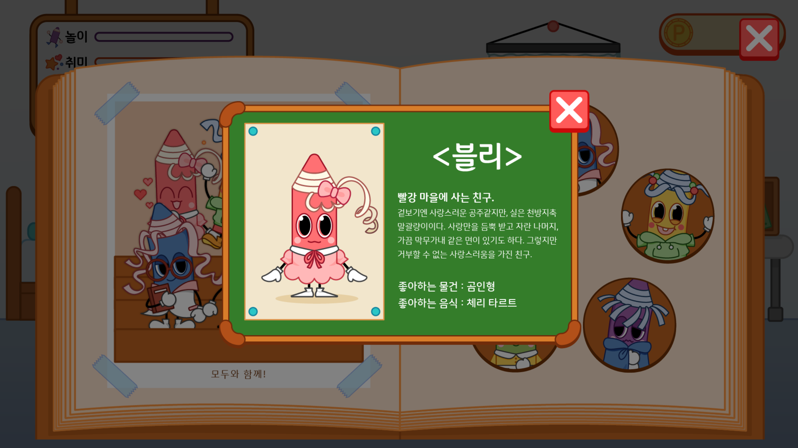
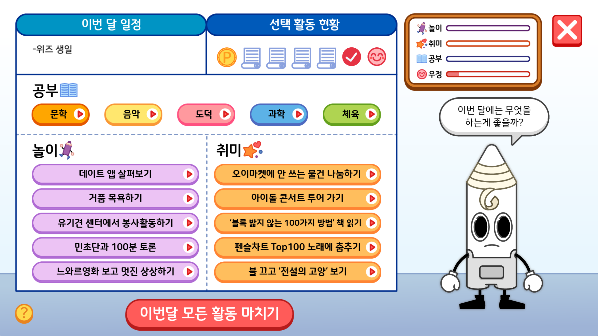
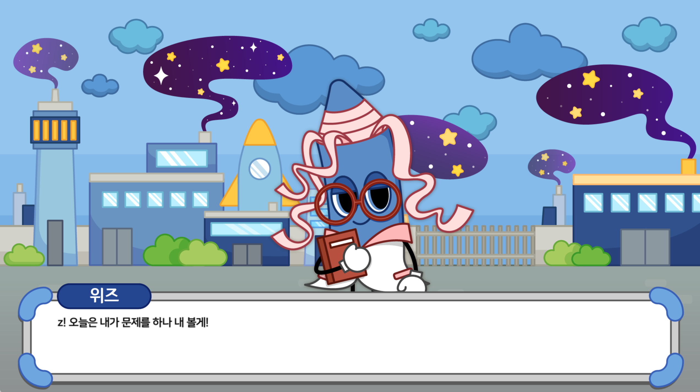
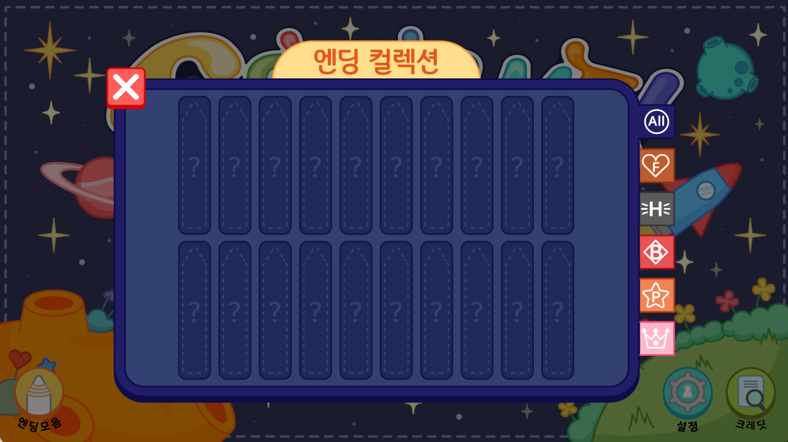
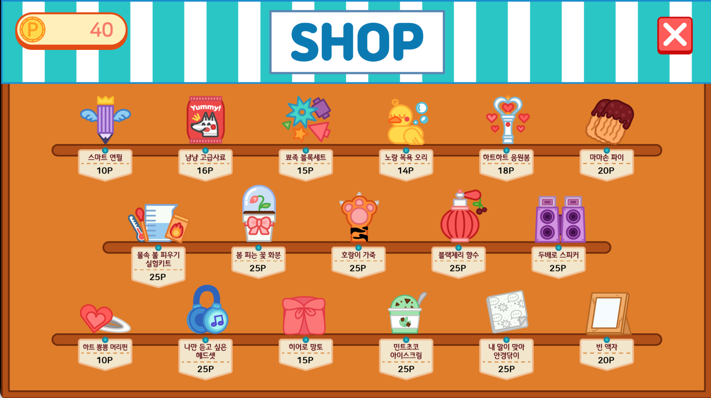
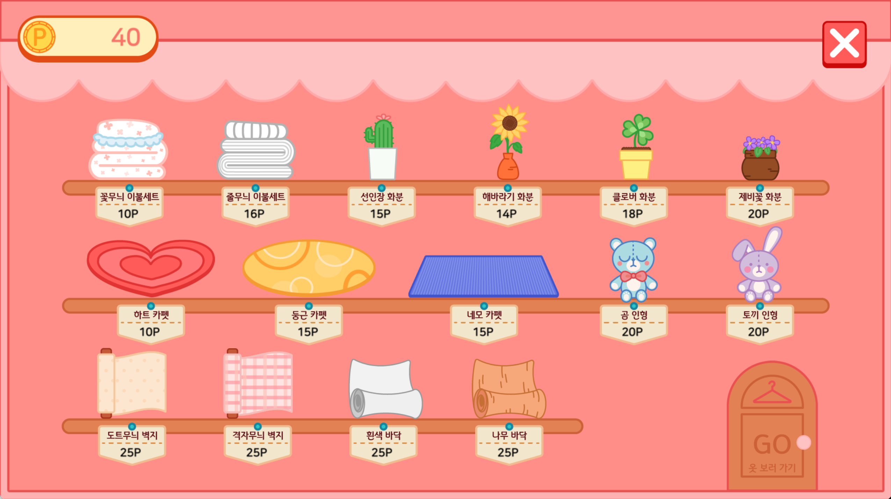

# Color Me

> 색연필 행성에서 자신만의 색을 찾아가는 육성 시뮬레이션 게임


## 게임 소개

**Color Me**는 색연필 행성에 사는 하얀색 색연필 주인공이 6개월 동안 공부, 놀기, 취미, 우정 활동을 반복하며 자신만의 색을 찾아가는 육성 시뮬레이션 게임입니다.

플레이어의 선택과 행동에 따라 **20가지 엔딩** 중 하나에 도달합니다.

[STOVE에서 플레이하기](https://store.onstove.com/ko/games/1952/)

## 한눈에 보기

- **장르**: 육성 시뮬레이션 / 비주얼 노벨
- **핵심 루프**: 월별 일정 관리 -> 활동 선택 -> 미니게임/이벤트 진행 -> 엔딩 분기
- **핵심 요소**: 4가지 스탯, 5개 마을 친구들, 방 꾸미기, 선물 시스템, 20가지 엔딩
- **플랫폼**: Android / iOS
- **개발 환경**: Solar2D (Corona SDK), Lua

## 대표 화면

### 타이틀 & 월드맵

| 타이틀 화면 | 월드맵 |
|:---:|:---:|
|  |  |

### 월별 일러스트

| 이른봄의 달 | 꽃피는 달 | 해변 달 |
|:---:|:---:|:---:|
|  |  |  |

| 단풍 달 | 도토리 달 | 눈꽃 달 |
|:---:|:---:|:---:|
|  |  |  |

### 캐릭터 화면

| 친구 목록 |
|:---:|
|  |

## 주요 스크린샷

### 핵심 플레이 화면

| 일정 관리 | 마을 방문 | 엔딩 모음 |
|:---:|:---:|:---:|
|  |  |  |

### 시스템 화면

| 상점 | 방 꾸미기 |
|:---:|:---:|
|  |  |

### 미니게임 (GIF)

| 두더지잡기 | 레몬잡기 | 카드뒤집기 |
|:---:|:---:|:---:|
|  |  |  |

| 숫자클릭 | 링통과 |
|:---:|:---:|
|  |  |

### 활동 (GIF)

| 놀이 | 취미 | 공부 |
|:---:|:---:|:---:|
|  |  |  |

## 주요 기능

### 육성 시스템

- **4가지 스탯**: 공부, 놀기, 취미, 우정
- **일정 관리**: 매달 활동을 선택해 스탯을 올리고 아이템으로 보너스를 획득
- **6개월 플레이**: 이른봄의 달부터 눈꽃 달까지 진행

### 5개 마을 & 5명의 친구

| 마을 | 캐릭터 | 성격 |
|---|---|---|
| 빨강 마을 | 블리 | 사랑이 넘치는 |
| 노랑 마을 | 조이 | 활기차고 즐거운 |
| 초록 마을 | 솔리 | 따뜻한 마음씨 |
| 파랑 마을 | 위즈 | 지혜로운 |
| 보라 마을 | 레이 | 용감한 |

### 미니게임 (5종)

- **두더지잡기**: 15초 제한 whack-a-mole
- **레몬잡기**: 물리엔진 기반 낙하물 캐치
- **카드뒤집기**: 메모리 매칭
- **숫자클릭**: 1~16 순서대로 클릭
- **링통과**: 장애물 회피

### 인벤토리 & 꾸미기

- **상점**: 일반 아이템 17종 + 인테리어 15종 + 코스튬 9종
- **방 꾸미기**: 벽지, 바닥, 이불, 카펫, 화분, 인형, 액자
- **코스튬**: 꼬마악마, 탐정, 해적, 공주님 등 10종

### 스토리 & 엔딩

- 월별 스토리 이벤트와 선택지 분기
- 캐릭터별 우정 대화 및 호감도 시스템
- 숨은그림찾기 이벤트
- **20가지 멀티 엔딩**: 우정(5) + 파스텔(5) + 혼합(6) + 히든(2) + 베스트(2)

## 기술 스택

| 항목 | 내용 |
|---|---|
| **언어** | Lua |
| **프레임워크** | Corona SDK (Solar2D) |
| **아키텍처** | Composer 씬 기반 화면 관리 |
| **데이터 저장** | JSON 파일 (`settings.json`, `items.json`, `endings.json`) |
| **해상도** | 1920 x 1080 (`letterbox`) |
| **오디오** | 로그 스케일 볼륨 제어, BGM/효과음 분리 채널 |
| **물리엔진** | Corona Physics |

## 프로젝트 구조

```text
color-me/
├── main.lua                  # 게임 진입점
├── config.lua                # 해상도/FPS 설정
├── build.settings            # 빌드 설정
├── loadsave.lua              # JSON 세이브/로드 유틸리티
│
├── title.lua                 # 타이틀 화면
├── title1.lua                # 엔딩 컬렉션
├── title2.lua                # 새 게임 (이름 입력)
├── title3.lua                # 엔딩 카드 뷰어
├── title_credit.lua          # 크레딧
├── tutorial.lua              # 오프닝 스토리
│
├── view00Room.lua            # 플레이어 방
├── view01Map.lua             # 월드맵
├── view01_guide.lua/2/3      # 인터랙티브 튜토리얼
├── view02Map.lua/2           # 마을 방문
├── view02schedule.lua        # 일정 관리
│
├── view03.lua                # 공부 활동
├── view03_fun.lua            # 놀기 활동
├── view03_hobby.lua          # 취미 활동
├── view03bag.lua             # 인벤토리
├── view03bag_deco.lua/2/3    # 방 꾸미기
│
├── view04Store.lua           # 일반 상점
├── view04Deco.lua            # 인테리어 상점
├── view04DecoClothes.lua     # 의상 상점
│
├── view05Dudu ~ view22card   # 미니게임
├── item_find_color.lua       # 숨은그림찾기 공통 모듈
├── item_find_*.lua           # 색상별 숨은그림찾기
│
├── viewmonth*_event.lua      # 월별 스토리 이벤트
├── viewmonth*_script.lua     # 월별 우정 대화
├── viewgift*.lua             # 선물 시스템
├── likeability.lua           # 호감도 리포트
├── view99end.lua             # 엔딩 분기
│
├── popup_overlay.lua         # 공통 팝업 모듈
├── volumeControl.lua         # 볼륨 설정
│
├── 이미지/                    # 게임 이미지 리소스
├── 음악/                      # BGM 및 효과음
├── 애니매이션/                 # 스프라이트 시트
└── font/                     # 커스텀 폰트
```

## 실행 방법

1. [Solar2D](https://solar2d.com/) 설치
2. Solar2D Simulator에서 `main.lua` 열기
3. 게임 실행

## 개발 정보

- **개발 기간**: 팀 프로젝트
- **장르**: 육성 시뮬레이션 / 비주얼 노벨
- **플랫폼**: Android / iOS
- **파일 규모**: 93개 Lua 파일, 약 30,000줄

## README 정리 기준

- 이 프로젝트는 전체적으로는 **스크린샷 중심** 구성이 더 잘 어울리고, 움직임이 중요한 **미니게임만 GIF**로 보여주는 편이 가장 균형이 좋습니다.
- README에는 대표 화면만 남기고, 세부 흐름 설명은 텍스트로 보완하는 편이 더 깔끔합니다.
- GIF는 많아질수록 무거워지기 때문에, 핵심 플레이 전체보다 미니게임처럼 동작이 중요한 콘텐츠에만 쓰는 쪽이 좋습니다.
